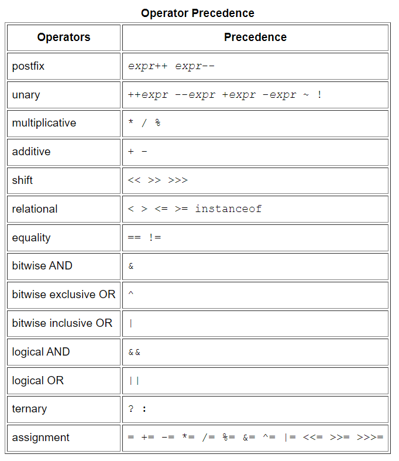

# Language Basics

- Variables
  - Instance Variables (Non-Static Fields)
    - fields declared without the `static` keyword
    - their values are <u>unique to each *instance* of a class</u> (to each object, in other words)
    - Instance Variables are declared inside a class but not within a method.
    - Heap 영역에 저장
  - Class Variables (Static Fields)
    - with the `static` modifier
    - this tells the compiler that there is <u>exactly one copy of this variable</u> in existence
    - Additionally, the keyword `final` could be added to indicate that the number of gears will never change.
  - Local Variables
    - Local Variables are declared within a method.
    - Should be initialized before its use
    - As such, local variables are only visible to the methods in which they are declared; they are not accessible from the rest of the class.
    - Stack 영역에 저장
  - Parameters
    - variables that provide extra information to a method
  - Naming

    - Variable names are case-sensitive.

    - Subsequent characters may be letters, digits, dollar signs, or underscore characters.

    - If the name you choose consists of only one word, spell that word in all lowercase letters.

  - [Primitive Data Types](https://docs.oracle.com/javase/8/docs/api/java/lang/String.html)

    - byte, short, int, long, float, double, boolean, char
  
  - Arrays
  
    - A container object that holds <u>a fixed number of values</u> of a single type.
  
      ```java
      class ArrayDemo {
          public static void main(String[] args) {
              // declares an array of integers
              int[] anArray;
      
              // allocates memory for 10 integers
              anArray = new int[10];
          }
      }
      ```
  
    - A multidimensional array is an array whose components are themselves arrays.
  
      ```java
      class MultiDimArrayDemo {
          public static void main(String[] args) {
              String[][] names = {
                  {"Mr. ", "Mrs. ", "Ms. "},
                  {"Smith", "Jones"}
              };
              // Mr. Smith
              System.out.println(names[0][0] + names[1][0]);
              // Ms. Jones
              System.out.println(names[0][2] + names[1][1]);
          }
      }
      ```
  
    - Some other useful operations provided by methods in the `java.util.Arrays` class are:
  
      - binarySearch
      - equals
      - fill
      - parallelSort
      - Stream
      - toString
  
- Operators

  - special symbols that perform specific operations on one, two, or three *operands*, and then return a result.

  - The operators in the following table are listed according to precedence order.

    

- Expressions,Statements, and Blocks

  - expressions are the core components of statements; statements may be grouped into blocks.

- Contrl Flow Statements

  - break up the flow of execution by employing decision making, looping, and branching, enabling your program to *conditionally* execute particular blocks of code

  - The decision-making statements 

    - `if-then(-else)`

    -  `switch`: the `switch` statement can have a number of possible execution paths.

    - If vs Switch

      ```Java
      If와 Switch는 동작방식이 다릅니다.
      JVM에서 Switch구문은, case에 따라 최적화된 2개의 자바 바이트코드를 생성합니다.
      
      이 때 공통적으로 모두 HashTable을 연상합니다.
      
      case의 값이 큰 차이가 없는 경우 TableSwitch형식의 컴파일 방식을,
      case의 값이 큰 차이가 나는 경우 LookupSwitch형식을 사용합니다.
      
      그렇기에, 각각 O(logN)과 O(1)의 시간복잡도를 갖고,
      이는 O(N)의 시간 복잡도를 가진 If보다 빠를 수밖에 없습니다.
      
      
      Swtich문이 If else 구문보다 약 3배에서 2배는 빠르게 작동합니다.
      ```

      - TableSwitch
        - switch의 조건 값의 범위를 인덱싱하여 jump table을 구성하고, 해당하는 인덱스의 실행지점으로 바로 점프
        - case가 spare한 경우(전체 범위를 인덱싱함)에는 공간낭비의 문제가 발생합니다
      - LookupSwitch
        - case 값만으로 테이블을 구성

  - The looping statements 

    - `for`
    -  `while`,`do-while`

  - The branching statements

    - `break`
    - `continue`
    - `return`