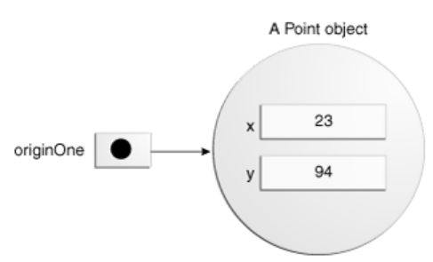
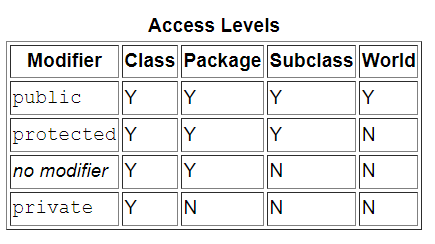

# Classes and Objects

- Classes
  
  - Declaring Classes
  
    ```java
    class MyClass extends MySuperClass implements YourInterface {
        // field, constructor, and
        // method declarations
    }
    ```
  
  - Declaring Member Variables
  
    1. Zero or more modifiers, such as `public` or `private`.
       - `public` modifier—the field is accessible from all classes.
       - `private` modifier—the field is accessible only within its own class.
    2. The field's type.
    3. The field's name.
       - the first letter of a class name should be capitalized, and
       - the first (or only) word in a method name should be a verb.

  - Defining Methods

    ```java
    public double calculateAnswer(double wingSpan, int numberOfEngines,
                                  double length, double grossTons) {
        //do the calculation here
    }
    ```
  
    1. Modifiers—such as `public`, `private`, and others you will learn about later.
    2. The return type—the data type of the value returned by the method, or `void` if the method does not return a value.
    3. The method name—the rules for field names apply to method names as well, but the convention is a little different.
       - method names should be a verb in lowercase or a multi-word name that begins with a verb in lowercase, followed by adjectives, nouns, etc.
       - In multi-word names, the first letter of each of the second and following words should be capitalized.
    4. The parameter list in parenthesis—a comma-delimited list of input parameters, preceded by their data types, enclosed by parentheses, `()`. If there are no parameters, you must use empty parentheses.
    5. An exception list—to be discussed later.
    6. The method body, enclosed between braces—the method's code, including the declaration of local variables, goes here.

    - **Overloading Methods**: <u>methods within a class can have the same name if they have different parameter lists</u>
      - The compiler does <u>not consider return type</u> when differentiating methods, so you cannot declare two methods with the same signature even if they have a different return type.
      - Overloaded methods should be used sparingly, as they can make code much less readable.
  
  - Constructors
  
    - They use the name of the class and have no return type.
    - The compiler automatically provides a no-argument, default constructor for any class without constructors.
  
  - Parameter VS Argument
  
    - Parameter:  Variable placeholders that are promised to be passed in the future.
    - Argument: Actual data that is being passed.
  
- Objects

  - Creating Objects

    ```java
    Point originOne = new Point(23, 94);
    ```

    1. **Declaration**: The code set in **bold** are all variable declarations that associate a variable name with an object type.

       

    2. **Instantiation**: The `new` keyword is a Java operator that creates the object.

       - The phrase "instantiating a class" means the same thing as "creating an object."
       - When you create an object, you are creating an "instance" of a class, therefore "instantiating" a class.

    3. **Initialization**: The `new` operator is followed by a call to a constructor, which initializes the new object.

       

  - Using Objects

    - Code that is outside the object's class must use an object reference or expression, followed by the dot (.) operator, followed by a simple field name, as in:

      ```java
      objectReference.fieldName
      objectReference.methodName(argumentList);
      ```

  - The Garbage Collector

    - The Java runtime environment deletes objects when it determines that they are no longer being used. This process is called *garbage collection*.
    - An object is eligible for garbage collection when there are no more references to that object.
    - you can explicitly drop an object reference by setting the variable to the special value `null`.

- More on Classes

  - 접근제한자

    - public : 모든 위치에서 접근 가능

    - protected : 같은 패키지에서 접근 가능, 다른 패키지 접근 불가능(단, 다른 패키지의 클래스와 상속 관계가 있을 경우 접근 가능)

    - default : 같은 패키지에서만 접근이 허용, 접근제한자가 선언이 안되었을 경우 기본 적용

    - private : 자신 클래스에서만 접근이 허용

      

  - Class Variables (Static Fields)

    - Fields that have the `static` modifier in their declaration are called *static fields* or *class variables*.

    - They are associated with the class, rather than with any object.

    - Class variables are referenced by the class name itself, as in

      ```java
      Bicycle.numberOfBicycles
      ```

  - Class Methods

    - Static methods, which have the `static` modifier in their declarations, should be invoked with the class name, without the need for creating an instance of the class, as in

      ```java
      ClassName.methodName(args)
      ```

  - Not all combinations of instance and class variables and methods are allowed:
    - Instance methods can access instance variables and instance methods directly.
    - Instance methods can access class variables and class methods directly.
    - Class methods can access class variables and class methods directly.
    - Class methods **cannot** access instance variables or instance methods directly—they must use an object reference. Also, class methods cannot use the `this` keyword as there is no instance for `this` to refer to.

  - Constants(상수)
    - The `final` modifier indicates that the value of this field cannot change.
      - 메소드 : 오버라이딩 금지
      - 클래스 : 상속 금
    - By convention, the names of constant values are spelled in uppercase letters.
    - If the name is composed of more than one word, the words are separated by an underscore (_).

- Nested Classes

  - The Java programming language allows you to define a class within another class.

    ```java
    class OuterClass {
        ...
        class NestedClass {
            ...
        }
    }
    ```

  - Why Use?

    - Use it if your requirements are similar to those of a local class, you want to make the type more widely available, and you don't require access to local variables or method parameters.
    - **It is a way of logically grouping classes that are only used in one place**
    - **It increases encapsulation**
    - **It can lead to more readable and maintainable code**

  - Inner Classes

    - To instantiate an inner class, you must first instantiate the outer class. 

      ```java
      OuterClass outerObject = new OuterClass(); 
      OuterClass.InnerClass innerObject = outerObject.new InnerClass();
      ```

    - Two kinds of inner classes

      1. local classes: You can declare an inner class within the body of a method.
         - Use it if you need to create more than one instance of a class, access its constructor, or introduce a new, named type.
      2. anonymous classes: You can also declare an inner class within the body of a method without naming the class.
         - Use it if you need to declare fields or additional methods.

  - Static Nested Classes
    - Note that a static nested class interacts with the instance members of its outer class just like any other top-level class.
  - Serialization
  - [Lambda Expressions](https://docs.oracle.com/javase/tutorial/java/javaOO/lambdaexpressions.html#use-case)
    
    - Use it if you are encapsulating a single unit of behavior that you want to pass to other code.

- Enum Types

  - An *enum type* is a special data type that enables for a variable to be a set of predefined constants.

  - Because they are constants, the names of an enum type's fields are in uppercase letters.

    ```java
    public enum Day {
        SUNDAY, MONDAY, TUESDAY, WEDNESDAY,
        THURSDAY, FRIDAY, SATURDAY 
    }
    ```